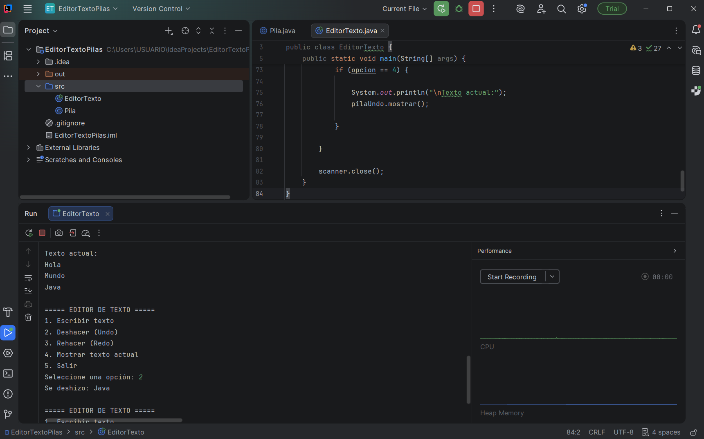

# Editor de Texto con Pilas (Stack)

## Objetivo
El objetivo de este proyecto es comprender el funcionamiento de la estructura de datos pila (Stack) mediante la implementación de un editor de texto simple que permita realizar operaciones de deshacer (Undo) y rehacer (Redo) utilizando el lenguaje de programación Java.

## Fundamentación teórica

Una **pila (Stack)** es una estructura de datos lineal que funciona bajo el principio **LIFO (Last In, First Out)**, lo que significa que **el último elemento en entrar es el primero en salir**.

En este proyecto se utiliza esta estructura para poder ver el comportamiento de un editor de texto.

Cuando el usuario escribe una línea de texto, esta se guarda en una pila. Si el usuario decide deshacer la acción, el último elemento agregado se elimina de la pila principal y se guarda en una pila secundaria para permitir rehacer la acción si el usuario lo desea.

Para implementar este comportamiento se utilizan dos pilas:

- **pilaUndo**: almacena las acciones realizadas por el usuario.
- **pilaRedo**: almacena las acciones que han sido deshechas para poder rehacerlas.

De esta manera se simula el funcionamiento de muchos programas reales que utilizan las funciones de Undo y Redo.

## Descripción del programa

El programa funciona como un editor de texto en consola donde el usuario puede escribir líneas de texto y utilizar diferentes opciones del menú.

Las principales funcionalidades del programa son:

- Escribir texto
- Deshacer la última acción (Undo)
- Rehacer la última acción deshecha (Redo)
- Mostrar el texto actual
- Salir del programa

Para lograr esto se implementó manualmente una estructura de pila utilizando arreglos en Java.

## Estructura del proyecto

El proyecto está compuesto por dos clases principales:

### Pila.java
Contiene la implementación de la estructura de datos pila.  
En esta clase se implementan los métodos fundamentales:

- push() → agrega un elemento a la pila.
- pop() → elimina el último elemento agregado.
- peek() → permite ver el último elemento sin eliminarlo.
- isEmpty() → verifica si la pila está vacía.

### EditorTexto.java
Contiene el programa principal y el menú en consola que permite interactuar con el usuario.  
En esta clase se utilizan dos pilas para implementar el sistema de Undo y Redo.

## Instrucciones de ejecución

1. Abrir el proyecto en un entorno de desarrollo como IntelliJ IDEA.
2. Ejecutar la clase EditorTexto.
3. Seleccionar una opción del menú que aparece en consola.
4. Escribir texto o utilizar las funciones de Undo y Redo.

## Tecnologías utilizadas

- Java
- IntelliJ IDEA
- Git
- GitHub

## Captura de ejecución

## Integrantes del grupo

- Marlon Rodríguez

